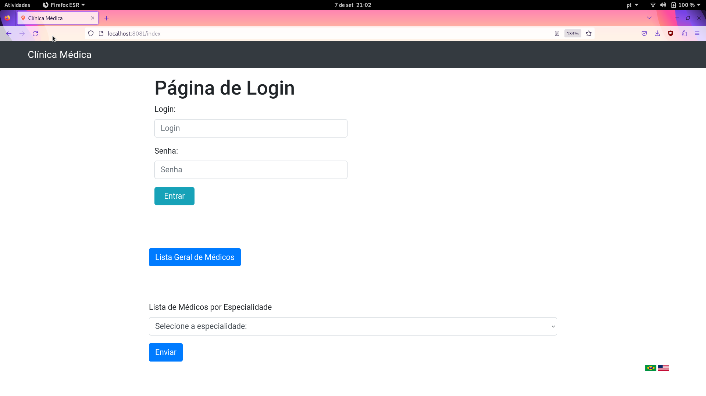
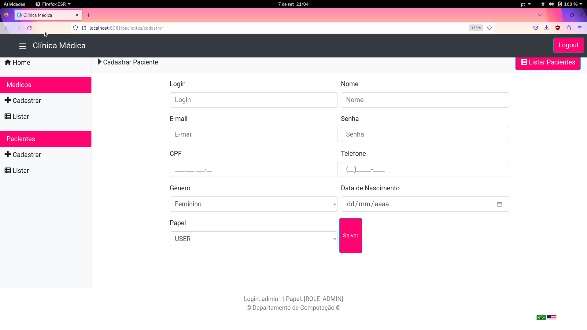
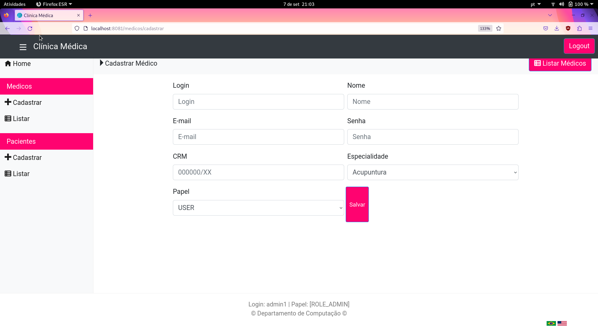
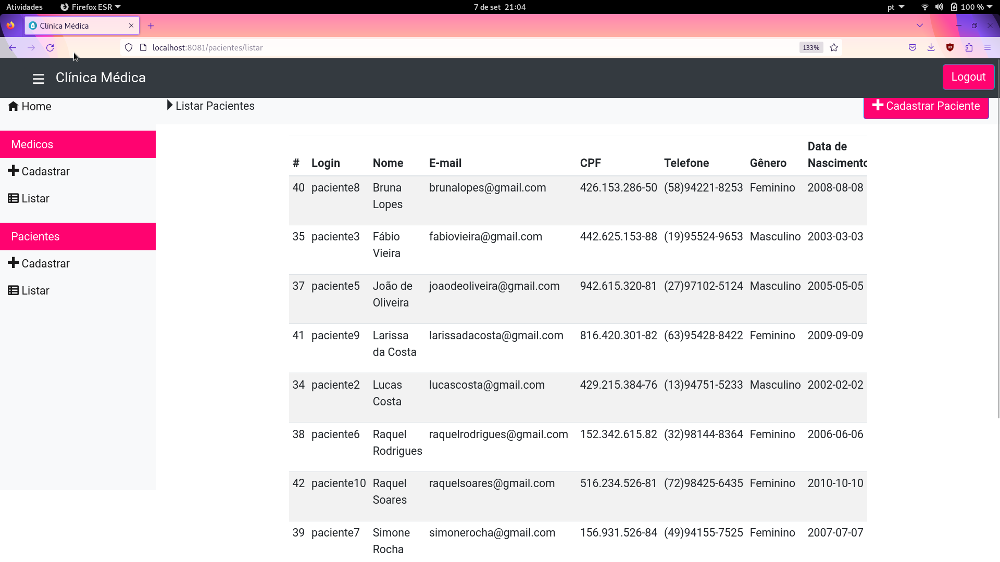
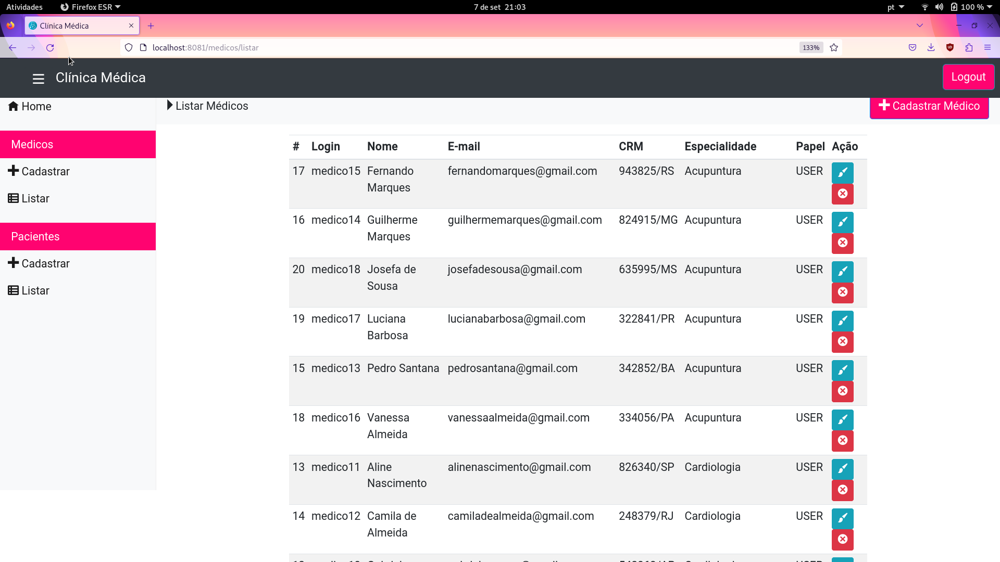
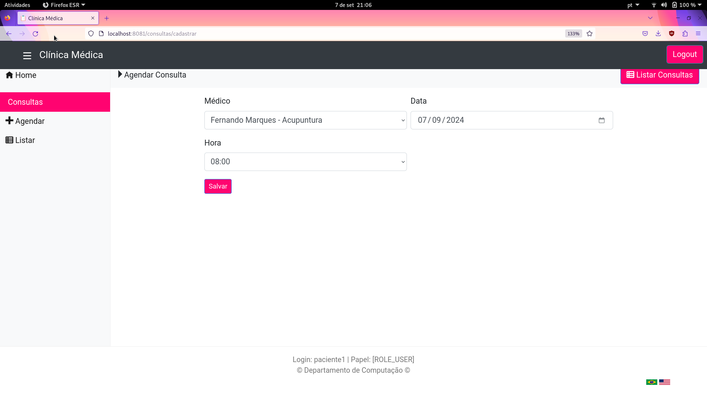
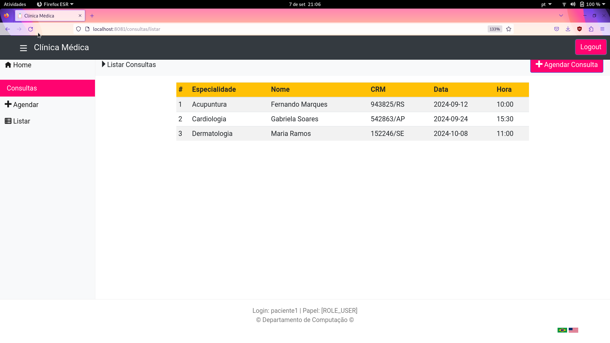
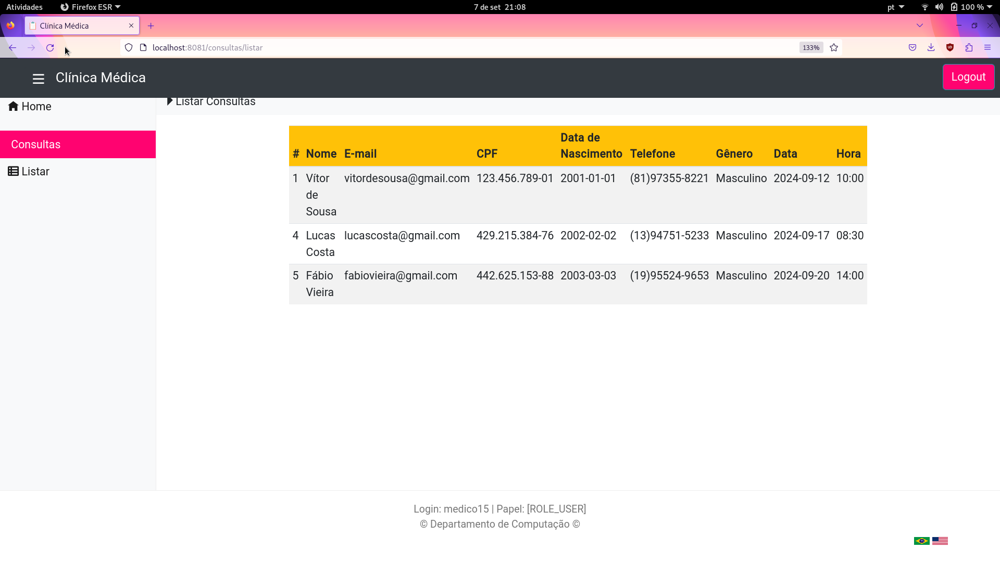
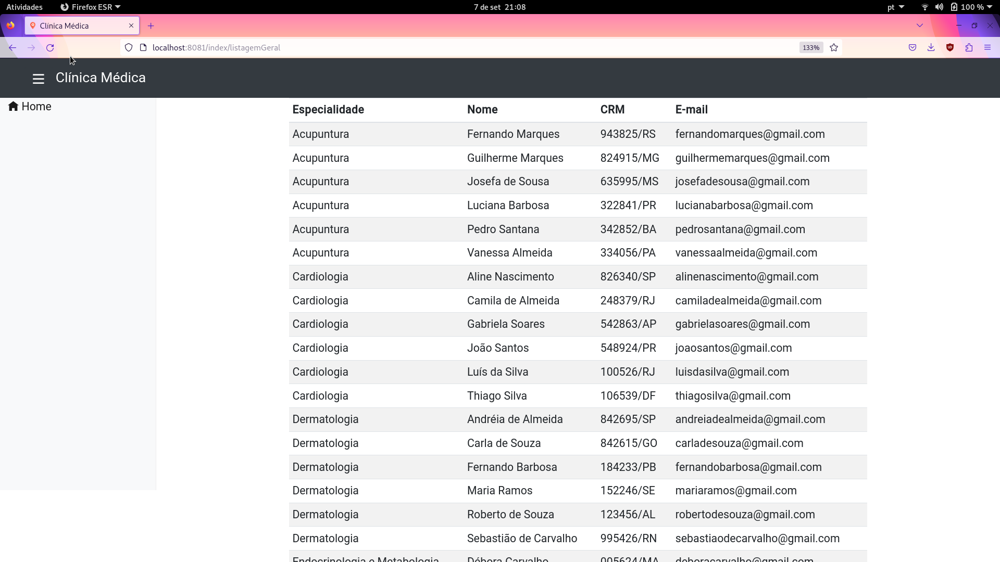

# Sistema web para agendamento de consultas médicas com Spring e Thymeleaf


Essa aplicação foi desenvolvida para a disciplina de Desenvolvimento de Software para Web 1 (DSW1) da Ufscar. Nessa versão, ele foi organizado em contêineres. O sistema foi construído na arquivetura MVC (Model-View-Controller) e usou as seguintes tecnologias: Spring MVC, Spring Data JPA, Spring Security, Thymeleaf e MySQL no lado do servidor e CSS no lado do cliente.

## Estrutura de arquivos

```
.
├── clinica-chart
├── docker-compose.yml
├── images
├── k8s
├── pom.xml
├── README.md
├── recompilacao.sh
├── redis
├── scripts
├── src
└── target
```

- A pasta ```clinica-chart``` contém todos os artefatos usados pelo Helm;
- O arquivo ```docker-compose.yml``` contém a orquestração dos contêineres da aplicação;
- Os arquivos ```.git``` e ```.gitignore``` contém configurações do GitHub;
- A pasta ```images``` contém as imagens deste README;
- A pasta ```k8s``` contém todos os artefatos usados pelo minikube fora do Helm;
- O arquivo ```pom.xml``` define as dependências da aplicação;
- O arquivo ```README.md``` é este arquivo de ajuda;
- A pasta ```redis``` contém os arquivos relacionados ao container Redis;
- A pasta ```scripts``` contém 4 scripts:
  - deployClinicaK8S.sh: faz o deploy completo da aplicação fora do Helm;
  - deployImagensDockerHub.sh: faz o deploy das imagens no docker hub;
  - recompilacao.sh: recompila a aplicação e substitui o antigo arquivo .jar pelo novo gerado;
  - deployImagensLocal.sh: faz o deploy local das imagens dentro do docker do minikube;
    > Obs: todas as imagens estâo no Docker Hub, entâo a execução desse script não é necessária;
- A pasta ```src``` contém todo o código fonte da aplicação;
- A pasta ```target``` contém os arquivos gerados após a compilação da aplicação.

A aplicação é composta por três contêineres:
- database:
  - responsável pelo banco de dados, portanto é de suma importância para a persistência dos dados da aplicação;
  - seu Dockerfile está localizado em ```src/main/java/br/ufscar/dc/dsw/dao/```;
- app:
  - responsável pelo backend e frontend, portanto é de suma importância para a utilização da aplicação por parte do usuário;
  - seu Dockerfile está em ```src/main/java/br/ufscar/dc/dsw/```;
- redis:
  - responsável pelo sistema de cache que reduz o número de acessos ao banco de dados, uma vez que armazena dados temporários e frequentemente acessados; portanto, é de suma importância para otimizar o desempenho da aplicação; 
  - seu Dockerfile está em ```redis/```.

## Funcionalidades

### O sistema oferece três tipos de cadastro:
  - de pacientes, com os seguintes dados: e-mail, senha, CPF, nome, telefone, sexo e data de nascimento;
  - de médicos, com os seguintes dados: e-mail, senha, CRM, nome e especialidade;
  - de consultas, com os seguintes dados: nome do médico, CRM do médico e data/hora da consulta. A duração da consulta é de 30 minutos e sempre inicia-se em "hora cheia" ou "hora meia".

### O sistema possui as seguintes funcionalidades:
  - CRUD de médicos mediante login de administrador;
  - CRUD de pacientes mediante login de administrador;
  - Listagem de todos os médicos em uma única página;
  - Listagem de todos os médicos por especialidade;
  - Agendamento de consulta com um médico meidante login do paciente;
  - Listagem de todas as consultas de um paciente mediante login do paciente;
  - Listagem de todas as consultas de um médico mediante login do médico;
  - Internacionalização em dois idiomas: português e inglês.

## Principais telas:












## Informações para execução local:
  - É necessário ter instalado o Docker (e o docker compose) e o Minikube;
  - É necessário adicionar a linha ```192.168.49.2 k8s.local``` no arquivo ```etc/hosts/``` para habilitar o uso do ingress;
  - Para a execução fora do Helm:
    - ```$ minikube addons enable ingress```
    - ```$ kubectl apply -f k8s/db/secret.yaml```
    - ```$ kubectl apply -f k8s/app/configmap.yaml```
    - ```$ kubectl apply -f k8s/db/pv.yaml```
    - ```$ kubectl apply -f k8s/db/pvc.yaml```
    - ```$ kubectl apply -f k8s/db/deployment.yaml```
    - ```$ kubectl apply -f k8s/db/service.yaml```
    - ```$ kubectl apply -f k8s/redis/deployment.yaml```
    - ```$ kubectl apply -f k8s/redis/service.yaml```
    - ```$ kubectl apply -f k8s/app/deployment.yaml```
    - ```$ kubectl apply -f k8s/app/service.yaml```
    - ```$ kubectl apply -f k8s/ingress.yaml```
    - Opcionalmente, é possível executar o script ./deployClinicaK8S localizado na pasta ```scripts```;
  - Para a execução com o Helm:
    - ```$ minikube delete```
    - ```$ minikube start```
    - ```$ minikube addons enable ingress```
    - ```$ helm install clinica clinica-chart```
  - Depois, a aplicação estará disponível na url "k8s.local".

## Outras informações:
  - A equipe foi composta por 1 integrante: Giovanna Victória Rossetto, RA 791648;
  - O banco de dados está populado com 2 administradores, 10 pacientes e 30 médicos;
  - Os logins e senhas dos usuários pré-cadastrados estão no arquivo "ClinicaApplication.java" no caminho "/src/main/java/br/ufscar/dc/dsw/ClinicaApplication.java";
  - Caso a aplicação seja modificada, é necessário executar os seguintes passos:
    - 1: Recompilar a aplicação com o comando ```mvn clean package -DskipTests``` na raiz;
    - 2: Substituir o novo arquivo Clinica-0.0.1-SNAPSHOT.jar, gerado na pasta ```target```, pelo antigo na pasta ```src/main/java/br/ufscar/dc/dsw/```;
    - 3: Fazer push novamente das imagens para o docker hub;
    - 4: Alternativamente, é possível executar os dois scripts ./recompilação.sh e ./deployImagensDockerHub.sh, localizados na pasta ```scripts```;

###### Autor: Giovanna Victória Rossetto
###### Data de criação: 05/07/2025 - 5 de julho de 2025
###### Última modificação: 17/07/2025 - 17 de julho de 2025
